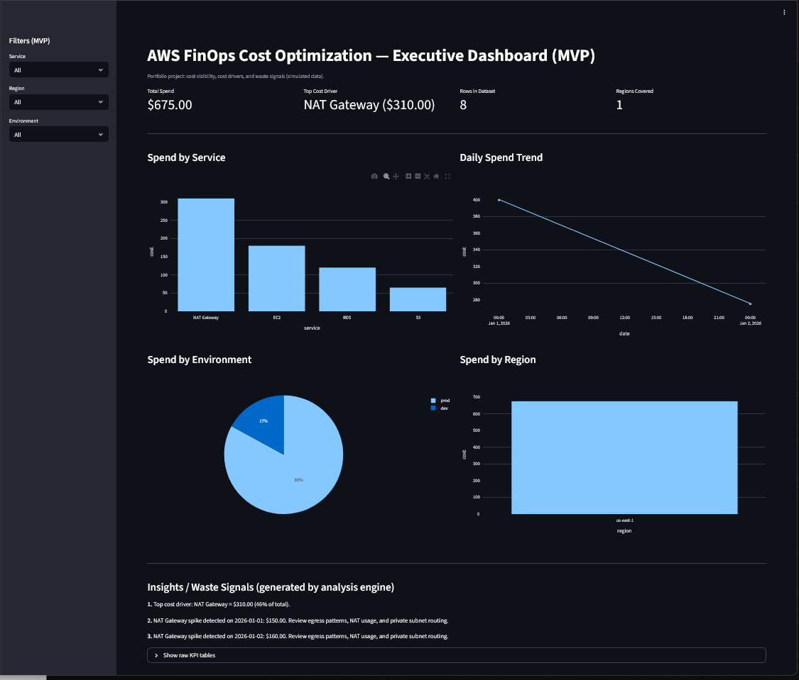
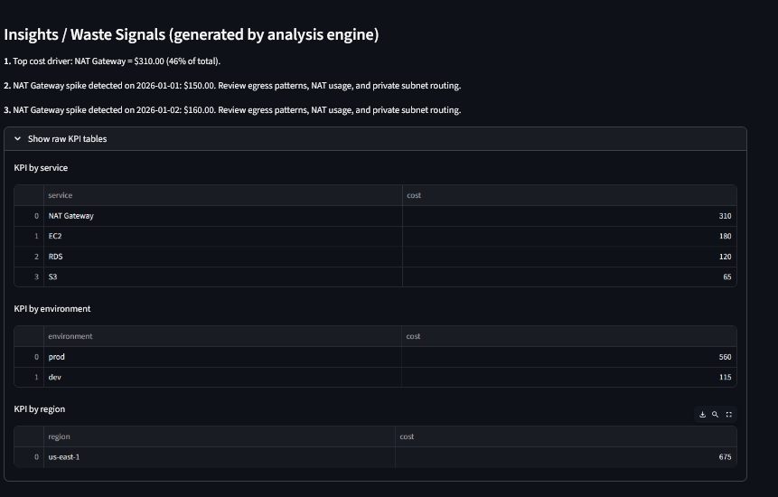

# AWS FinOps Cost Optimization Platform

Enterprise-grade cloud cost visibility and optimization platform designed from a Cloud Architect perspective.

This project demonstrates how modern cloud architecture must integrate financial governance (FinOps) with technical design to ensure scalability, cost control and operational resilience.

---

## Live Demo

http://54.235.55.3:8501

---

## Dashboard Preview

### Executive Cost Overview

### Cost Insights & Anomaly Detection

---

## Architecture Overview

Cost dataset (CUR-like simulation)  
→ Data Lake pattern (S3 as source of truth)  
→ Python FinOps analytics engine  
→ KPI generation & anomaly detection  
→ Executive dashboard (Streamlit)  
→ Production-style deployment on AWS EC2  

---

## Why This Project Exists

Most companies believe they have a cloud strategy.  
In reality, they only have a growing monthly bill.

Cloud without financial control becomes operational debt.

This project demonstrates how cloud architects can implement cost visibility, anomaly detection and governance from day one.

---

## Key Capabilities

### Cost visibility
- Total cloud spend tracking
- Cost by service
- Cost by environment (prod vs dev)
- Cost by region

### FinOps anomaly detection
- NAT Gateway cost spikes
- Service-level cost dominance
- Environment cost anomalies
- Waste signal detection

### Executive dashboard
- Real-time visualization
- Cost allocation visibility
- KPI summaries for leadership
- Operational insights

### Production-style deployment
- Hosted on AWS EC2
- Persistent service using systemd
- Secure access via security groups
- Remote dashboard access

---

## Tech Stack

- AWS EC2
- AWS S3 (data lake concept)
- Python (Pandas analytics engine)
- Streamlit dashboard
- FinOps methodology

---

## Sample Insights Generated

- NAT Gateway responsible for ~46% of total cost
- Production environment driving majority of spend
- Daily anomaly detection for cost spikes
- Cost allocation visibility by environment

---

## What This Demonstrates (Architect Level)

Cloud architecture is not only about infrastructure. It is about:
- Cost governance
- Financial visibility
- Operational resilience
- Business alignment

A system that scales technically but not financially is not sustainable.

---

## Roadmap (Next Iteration)

- Integrate real AWS CUR billing data into S3
- Query with Athena over the cost data lake
- Automate anomaly detection with Lambda
- Budget alerts via SNS
- Multi-account governance dashboard
- FinOps automation workflows

---

## Author

Fernando Kuellar  
Cloud Architect | FinOps | Multicloud | AWS | OCI
